# Tugas Besar 1 IF3110 & IF3159

Anggota kelompok:  
Avisenna Abimanyu / 13517010 
Fata Nugraha / 13517109 
Rakhmad Budiono / 13517151 
Nathaniel Evan G / 13516055 

# Deskripsi:

Aplikasi web ini merupakan aplikasi yang dibangun untuk memenuhi tugas mata kuliah IF3110 dan IF3159. Web ini merupakan web yang berfungsi sebagai platform untuk memesan tiket bioskop secara online.

User yang ingin menggunakan aplikasi ini diminta untuk login terlebih dahulu. Bagi user yang belum terdaftar maka user diwajibkan untuk registrasi terlebih dahulu di web ini.

Ketika user telah berhasil login ke dalam web ini, user akan di arahkan ke homepage atau halaman utama. Web ini memiliki beberapa fitur seperti melihat pilihan film yang pada periode tertentu sedang ditayangkan. Kemudian web ini juga dapat mencari film yang diinginkan pengguna. Web ini juga memiliki fitur untuk melihat review dan deskripsi dari film yang dimuat di web tersebut.

Sebagai user pengguna dapat memesan tiket melalui web ini dan memilih posisi duduk yang diinginkan. Dan terakhir user juga dapat menambahkan, menghapus, dan merubah review terhadap film tertentu.

# Daftar Requirement:

1. Untuk frontend, gunakan Javascript, HTML dan CSS. Tidak boleh menggunakan library atau framework CSS atau JS (e.g. JQuery, lodash, atau Bootstrap). CSS sebisa mungkin ada di file yang berbeda dengan HTML (tidak inline styling).

2. Untuk backend, wajib menggunakan PHP tanpa framework apapun. Harap diperhatikan, Anda harus mengimplementasikan fitur menggunakan HTTP method yang tepat.

3. Gunakan MySQL untuk menyimpan data.

# Cara instalasi dan menjalankan server:

1. Untuk menjalankan program gunakan XAMPP, kemudian jalankan perintah "php -S localhost:8080 -t public" tanpa tanda kutip.
2. Pastikan extension pdo_mysql dan mysqli sudah diaktifkan di php.ini
3. Untuk meload database kunjungi link localhost:8080/load, pastikan terlebih dahulu file app/config/config.php sudah diisi dengan identitas database dengan benar

# Screenshot tampilan aplikasi

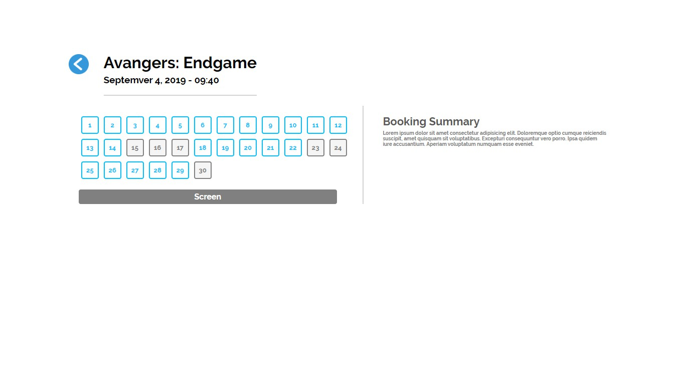
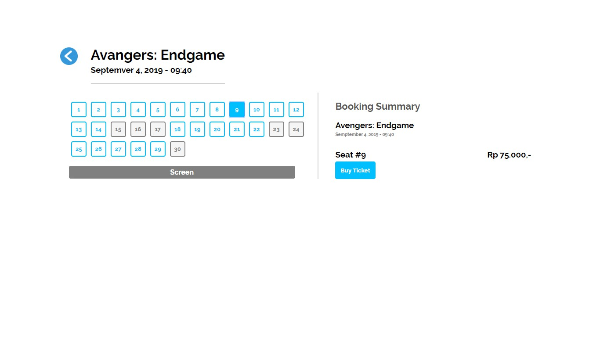
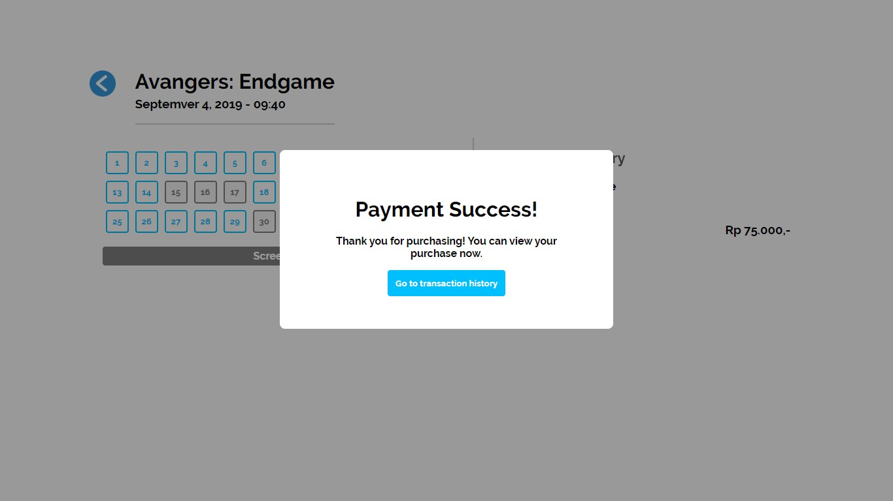
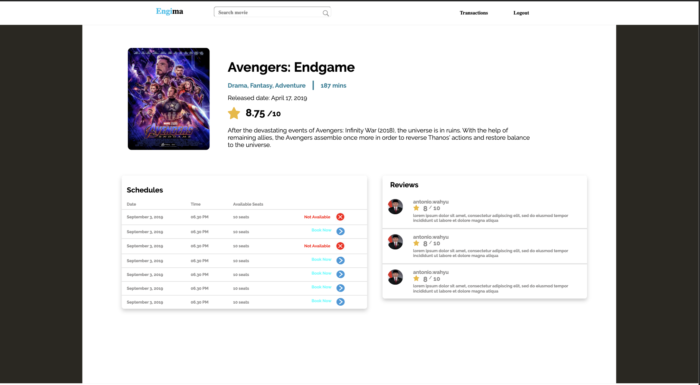
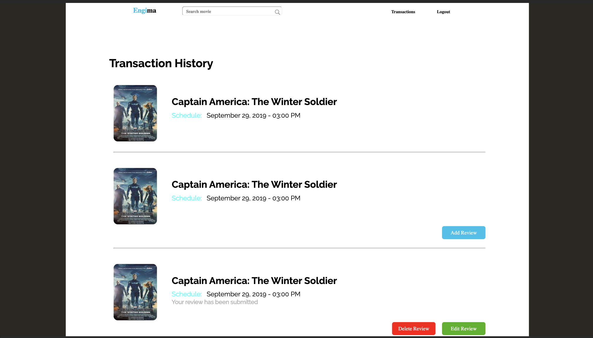
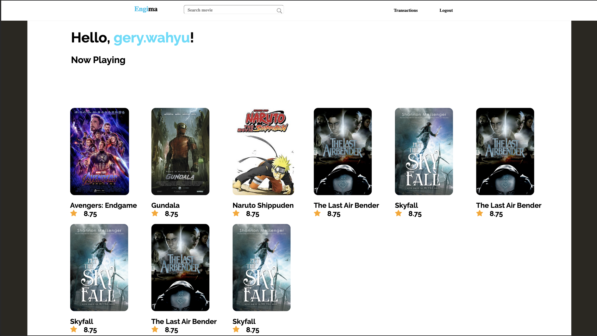
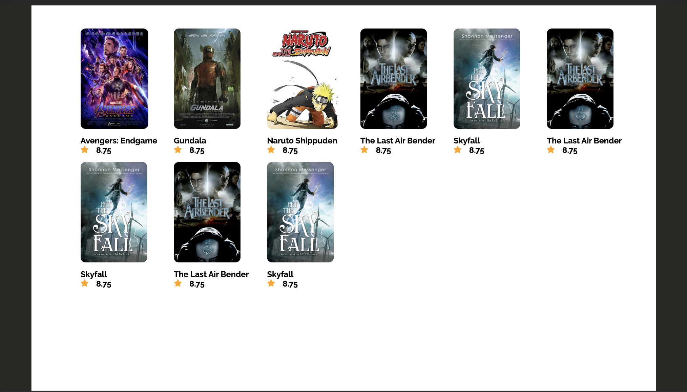
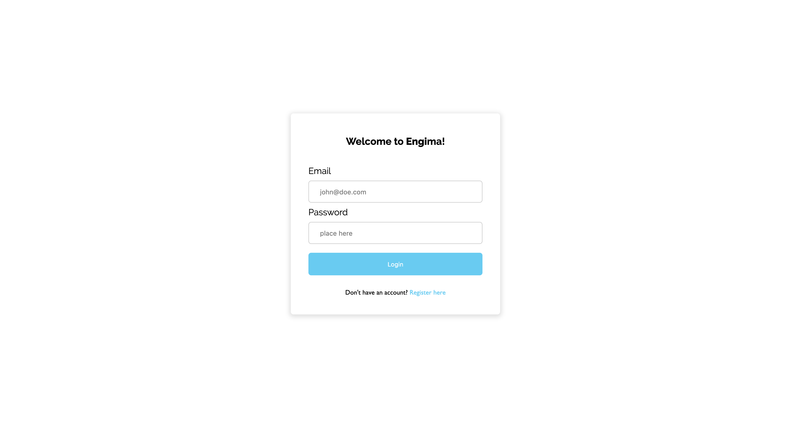
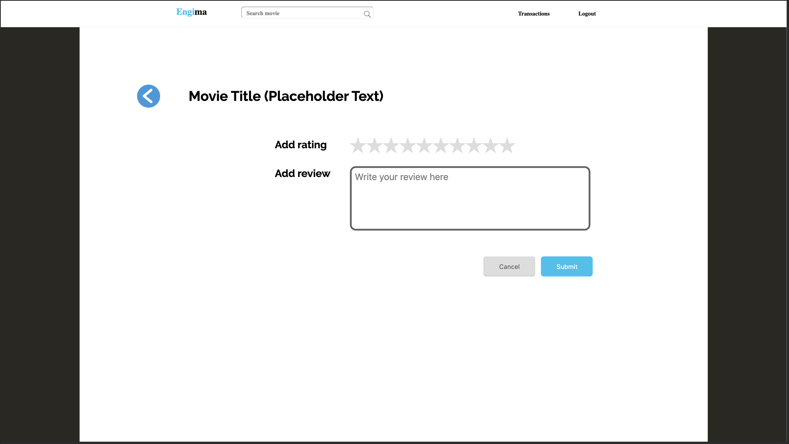
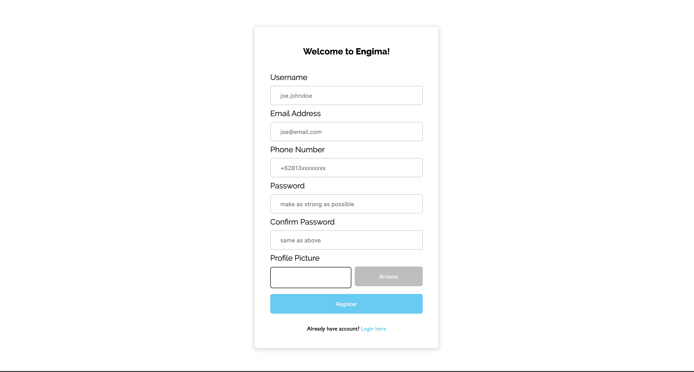
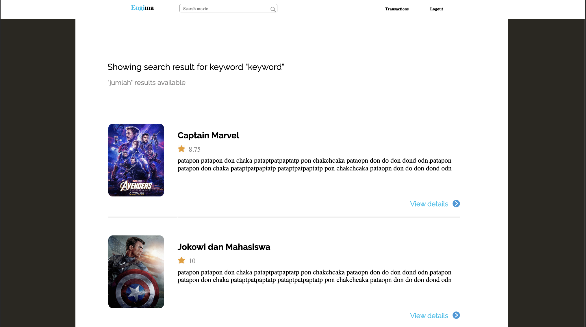
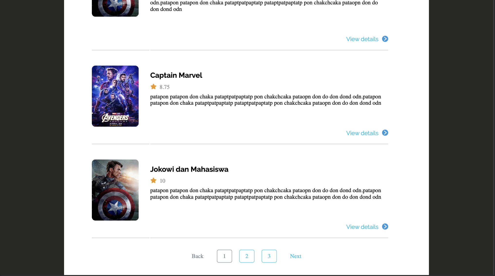

# Pembagian tugas

Fata Nugraha (13517109):  
authentication, mvc, api, integrating frontend and backend, testing, UI tweaking  
Avisenna Abimanyu (13517010):  
movie description page, search result page, homepage and other frontend stuff, api,integrating frontend and backend, testing  
Rakhmad Budiono (13517151):  
fitur booking film, api, mvc, integrating frontend and backend, testing, UI tweaking  
Nathaniel Evan G (135160550:  
movie rating page and other frontend stuff, header page, api, integrating frontend and backend, testing  